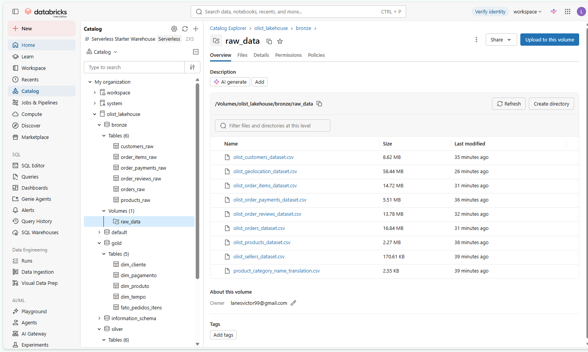
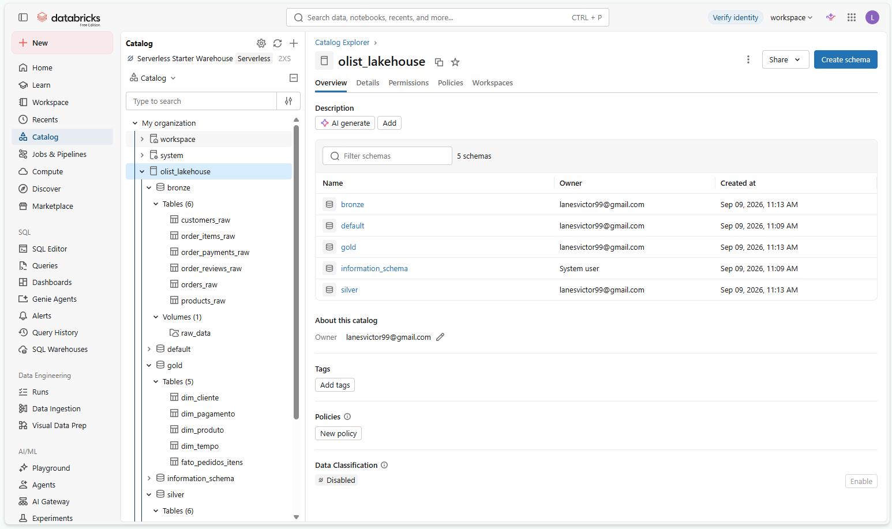
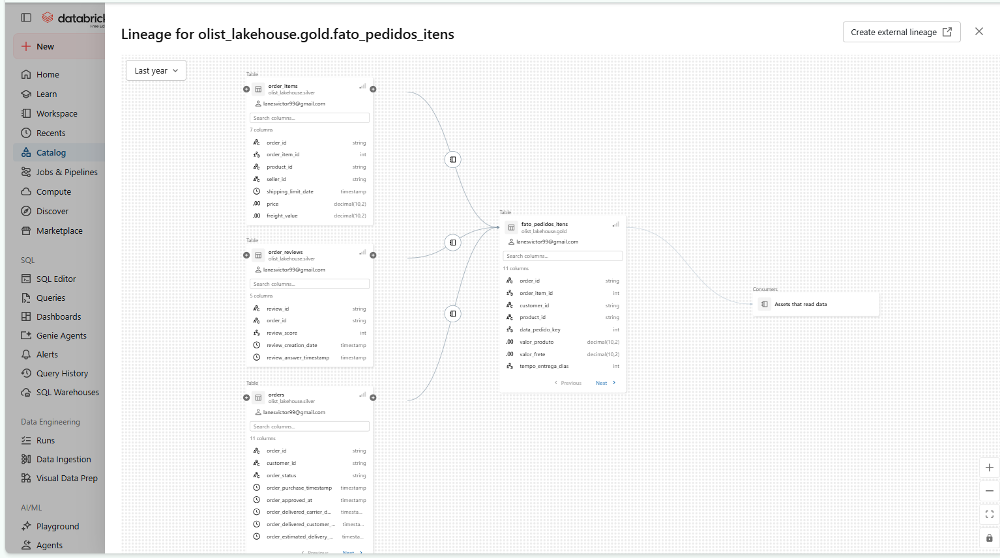
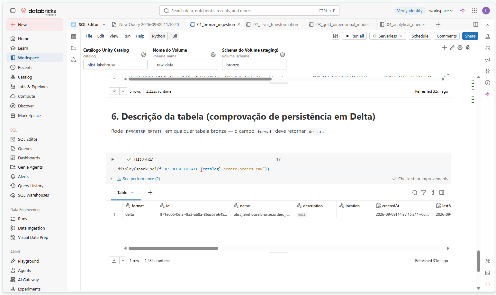
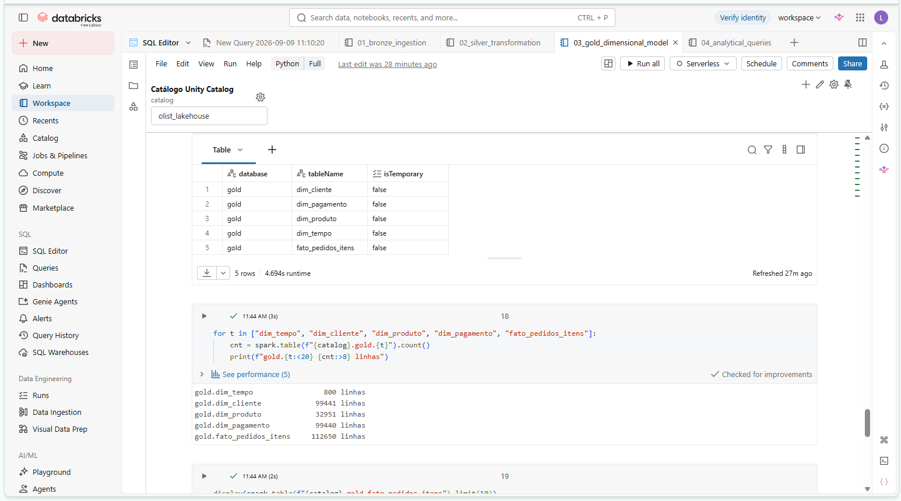
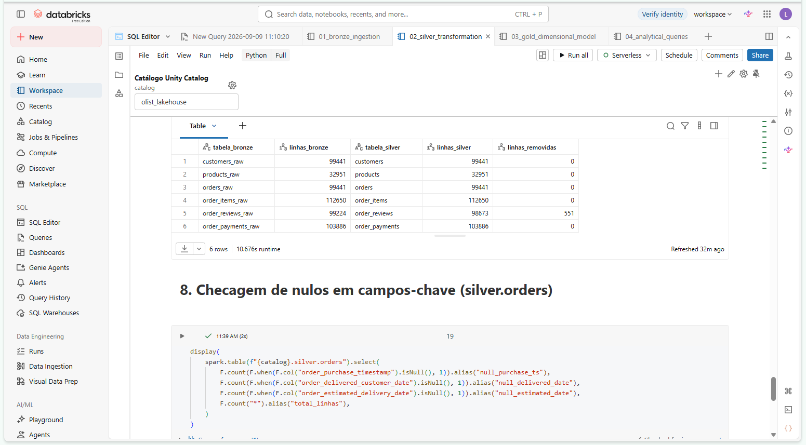
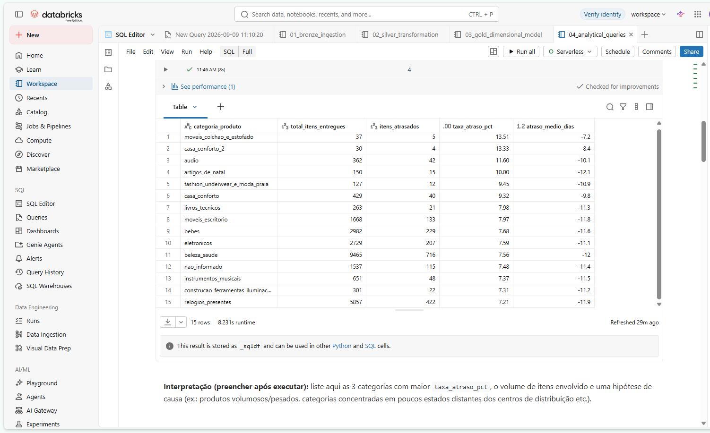
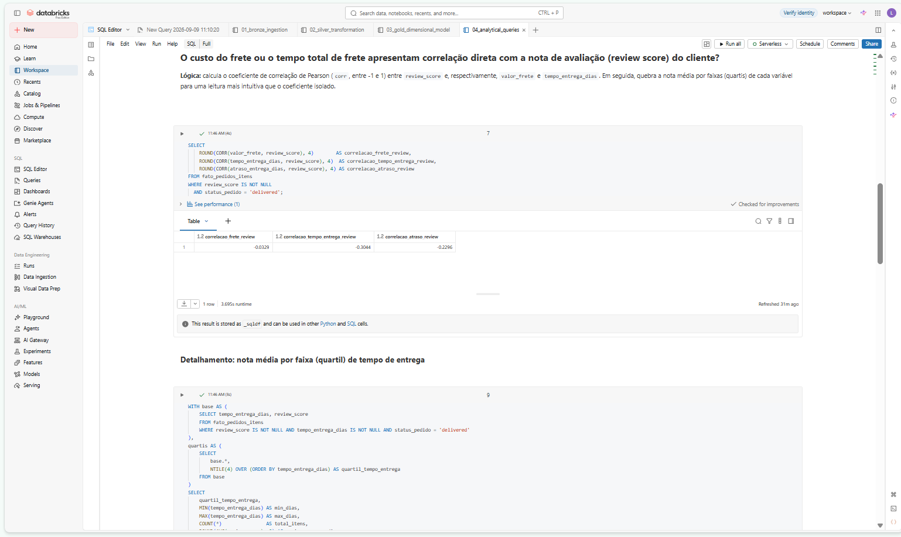
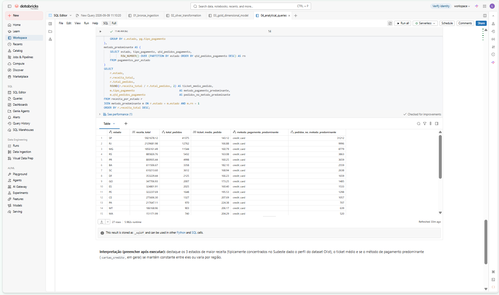

# MVP de Engenharia de Dados — Lakehouse na Nuvem (Arquitetura Medalhão)
### E-commerce e Logística — Brazilian E-Commerce Public Dataset by Olist

> MVP da pós-graduação em Engenharia de Dados. Pipeline de ponta a ponta no **Databricks
> Community/Free Edition**, com **Unity Catalog**, seguindo a Arquitetura Medalhão
> (Bronze → Silver → Gold) e persistência em **Delta Lake**. Nenhuma etapa foi executada em
> Google Colab.

---

## Sumário

1. [Contexto de Negócios e Perguntas (Etapa 2 e 4.1)](#1-contexto-de-negócios-e-perguntas-etapa-2-e-41)
2. [Carga dos Dados (Etapa 4.2)](#2-carga-dos-dados-etapa-42)
3. [Modelagem e Catálogo de Dados (Etapa 4.3)](#3-modelagem-e-catálogo-de-dados-etapa-43)
4. [Pipeline de Dados (Etapa 4.4)](#4-pipeline-de-dados-etapa-44)
5. [Qualidade de Dados (Etapa 4.5)](#5-qualidade-de-dados-etapa-45)
6. [Análise de Dados (Etapa 4.5)](#6-análise-de-dados-etapa-45)
7. [Autoavaliação](#7-autoavaliação)

---

## 1. Contexto de Negócios e Perguntas (Etapa 2 e 4.1)

### 1.1 Problema

A Olist é um marketplace brasileiro que conecta pequenos e médios lojistas a grandes canais de
venda. Um dos maiores desafios de um marketplace é a previsibilidade logística: prazos de entrega
não cumpridos e fretes caros impactam diretamente a satisfação do cliente (e, por consequência, a
recorrência de compra). Este MVP constrói um lakehouse analítico para investigar o comportamento
de entregas, fretes, avaliações e receita por região, permitindo decisões orientadas a dados sobre
gestão logística e priorização comercial por estado.

### 1.2 Perguntas de negócio

1. **Quais categorias de produtos concentram o maior índice de atrasos na entrega em relação ao prazo estimado?**
2. **O custo do frete ou o tempo total de frete apresentam correlação direta com a nota de avaliação (review score) do cliente?**
3. **Quais estados brasileiros geram maior receita total e qual é o método de pagamento predominante em cada um deles?**

### 1.3 Fonte de dados e licença

- **Dataset:** [Brazilian E-Commerce Public Dataset by Olist](https://www.kaggle.com/datasets/olistbr/brazilian-ecommerce) (Kaggle)
- **Licença:** CC BY-NC-SA 4.0 — uso acadêmico permitido, com atribuição à Olist e sem uso comercial.
- **Período coberto:** pedidos realizados entre 2016 e 2018.
- **Arquivos utilizados no escopo do MVP:**

| Arquivo | Conteúdo |
|---|---|
| `olist_orders_dataset.csv` | Pedidos, datas de compra, aprovação, envio e entrega |
| `olist_order_items_dataset.csv` | Itens do pedido, preços e fretes |
| `olist_products_dataset.csv` | Categorias e métricas físicas dos produtos |
| `olist_customers_dataset.csv` | Localização (cidade/estado) do cliente |
| `olist_order_reviews_dataset.csv` | Avaliações e notas (1–5) |
| `olist_order_payments_dataset.csv` | Métodos de pagamento e parcelamento |

### 1.4 Estrutura dos dados brutos (colunas principais por tabela)

Resumo das colunas originais de cada CSV, antes de qualquer transformação (schema completo com tipos
inferidos no dicionário de dados, seção 3.2):

| Tabela bruta | Colunas principais |
|---|---|
| `customers` | `customer_id`, `customer_unique_id`, `customer_zip_code_prefix`, `customer_city`, `customer_state` |
| `products` | `product_id`, `product_category_name`, `product_weight_g`, `product_length_cm`, `product_height_cm`, `product_width_cm` |
| `orders` | `order_id`, `customer_id`, `order_status`, `order_purchase_timestamp`, `order_approved_at`, `order_delivered_carrier_date`, `order_delivered_customer_date`, `order_estimated_delivery_date` |
| `order_items` | `order_id`, `order_item_id`, `product_id`, `seller_id`, `shipping_limit_date`, `price`, `freight_value` |
| `order_reviews` | `review_id`, `order_id`, `review_score`, `review_creation_date`, `review_answer_timestamp` |
| `order_payments` | `order_id`, `payment_sequential`, `payment_type`, `payment_installments`, `payment_value` |

As tabelas se relacionam por `order_id` (chave central do modelo) e `product_id`/`customer_id` como
chaves estrangeiras de produto e cliente, respectivamente — essa é a base do modelo dimensional
construído na camada Gold (seção 3).

---

## 2. Carga dos Dados (Etapa 4.2)

### 2.1 Metodologia de ingestão

1. Baixe o dataset do Kaggle (link acima) e extraia os 6 arquivos `.csv` do escopo.
2. No Databricks, crie (ou reutilize) um catálogo Unity Catalog, os schemas `bronze`/`silver`/`gold`
   e um **Volume** de staging — tudo automatizado pela primeira célula do notebook
   [`01_bronze_ingestion.py`](notebooks/01_bronze_ingestion.py).
3. Faça o **upload manual** dos 6 CSVs para o Volume (`Catalog Explorer` → volume → **Upload to this
   volume**, ou tela **Add data → Upload files to a volume**). Isso simula a "landing zone" de um
   pipeline de ingestão em batch.
4. Execute o notebook `01_bronze_ingestion.py`, que lê cada CSV do Volume e grava como tabela **Delta**
   na camada Bronze, adicionando metadados de ingestão (`_source_file`, `_ingestion_timestamp`,
   `_ingestion_date`).

### 2.2 Scripts de carga

| Script | Camada | Link |
|---|---|---|
| Ingestão Bronze | Bronze | [`notebooks/01_bronze_ingestion.py`](notebooks/01_bronze_ingestion.py) |
| Transformação Silver | Silver | [`notebooks/02_silver_transformation.py`](notebooks/02_silver_transformation.py) |
| Modelo dimensional Gold | Gold | [`notebooks/03_gold_dimensional_model.py`](notebooks/03_gold_dimensional_model.py) |
| Consultas analíticas | Gold (leitura) | [`notebooks/04_analytical_queries.sql`](notebooks/04_analytical_queries.sql) |

### 2.3 Evidência — upload no Volume



*Catalog Explorer mostrando o Volume `bronze/raw_data` com os arquivos `.csv` do dataset Olist já enviados.*

---

## 3. Modelagem e Catálogo de Dados (Etapa 4.3)

### 3.1 Diagrama relacional (Star Schema — camada Gold)

```
                        ┌──────────────────┐
                        │   dim_tempo       │
                        │ (data_key PK)     │
                        └────────┬──────────┘
                                 │
┌──────────────┐        ┌───────▼───────────┐        ┌──────────────┐
│ dim_cliente   │◄──────►│ fato_pedidos_itens │◄──────►│ dim_produto   │
│ (customer_id) │        │  grão: item do     │        │ (product_id)  │
└──────────────┘        │       pedido       │        └──────────────┘
                        └───────┬───────────┘
                                 │
                        ┌───────▼───────────┐
                        │  dim_pagamento     │
                        │   (order_id PK)    │
                        └────────────────────┘
```

### 3.2 Catálogo de dados (transcrito)

Catálogo completo das tabelas Silver e Gold — schema completo, com tipos, chaves e regras de
domínio, também disponível em [`docs/data_dictionary.md`](docs/data_dictionary.md) junto com o
detalhamento da camada Bronze.

#### Camada Silver

**`silver.customers`** — grão: 1 linha por cliente (`customer_id`)

| Campo | Tipo | Domínio / Regra | Descrição |
|---|---|---|---|
| `customer_id` | string | não nulo, único | Identificador do cliente **por pedido** (chave técnica) |
| `customer_unique_id` | string | não nulo | Identificador único do cliente ao longo do tempo |
| `customer_zip_code_prefix` | int | 5 dígitos | Prefixo do CEP do cliente |
| `customer_city` | string | trim aplicado | Cidade do cliente |
| `customer_state` | string | 2 letras, UF maiúscula | Estado (UF) do cliente |

**`silver.products`** — grão: 1 linha por produto (`product_id`)

| Campo | Tipo | Domínio / Regra | Descrição |
|---|---|---|---|
| `product_id` | string | não nulo, único | Identificador do produto |
| `product_category_name` | string | `'nao_informado'` se nulo | Categoria do produto (em português) |
| `product_weight_g` | double | ≥ 0 | Peso do produto em gramas |
| `product_length_cm` / `product_height_cm` / `product_width_cm` | double | ≥ 0 | Dimensões físicas em cm |
| `product_volume_cm3` | double | derivado: `length * height * width` | Volume cúbico do produto |

**`silver.orders`** — grão: 1 linha por pedido (`order_id`)

| Campo | Tipo | Domínio / Regra | Descrição |
|---|---|---|---|
| `order_id` | string | não nulo, único | Identificador do pedido |
| `customer_id` | string | não nulo, FK → `silver.customers` | Cliente do pedido |
| `order_status` | string | `delivered`, `shipped`, `canceled`, etc. | Status do pedido, minúsculo |
| `order_purchase_timestamp` | timestamp | não nulo | Data/hora da compra |
| `order_delivered_customer_date` | timestamp | nullable | Data efetiva de entrega ao cliente |
| `order_estimated_delivery_date` | timestamp | não nulo | Data estimada de entrega |
| `tempo_entrega_dias` | int | derivado | Dias entre compra e entrega |
| `atraso_entrega_dias` | int | derivado | Dias de atraso vs. estimativa (positivo = atrasado) |
| `entregue_no_prazo` | boolean | derivado, nullable | `true` se entregue até a data estimada |

**`silver.order_items`** — grão: item do pedido (`order_id` + `order_item_id`)

| Campo | Tipo | Domínio / Regra | Descrição |
|---|---|---|---|
| `order_id` | string | FK → `silver.orders` | Pedido ao qual o item pertence |
| `order_item_id` | int | ≥ 1 | Número sequencial do item dentro do pedido |
| `product_id` | string | FK → `silver.products` | Produto do item |
| `price` | decimal(10,2) | ≥ 0 | Preço do item (sem frete) |
| `freight_value` | decimal(10,2) | ≥ 0 | Valor do frete do item |

**`silver.order_reviews`** — grão: 1 linha por pedido (deduplicado pela review mais recente)

| Campo | Tipo | Domínio / Regra | Descrição |
|---|---|---|---|
| `review_id` | string | não nulo | Identificador da avaliação |
| `order_id` | string | FK → `silver.orders` | Pedido avaliado |
| `review_score` | int | 1 a 5 | Nota da avaliação |

**`silver.order_payments`** — grão: 1 linha por parcela de pagamento

| Campo | Tipo | Domínio / Regra | Descrição |
|---|---|---|---|
| `order_id` | string | FK → `silver.orders` | Pedido pago |
| `payment_type` | string | `credit_card`, `boleto`, `voucher`, `debit_card` | Forma de pagamento, minúscula |
| `payment_installments` | int | ≥ 0 | Número de parcelas |
| `payment_value` | decimal(10,2) | ≥ 0 | Valor pago nessa parcela/transação |

#### Camada Gold — Star Schema

**`gold.fato_pedidos_itens`** (fato — grão: item do pedido)

| Campo | Tipo | Chave | Descrição |
|---|---|---|---|
| `order_id` | string | PK (composta), FK → `dim_pagamento` | Identificador do pedido |
| `order_item_id` | int | PK (composta) | Número do item dentro do pedido |
| `customer_id` | string | FK → `dim_cliente` | Cliente do pedido |
| `product_id` | string | FK → `dim_produto` | Produto do item |
| `data_pedido_key` | int (yyyyMMdd) | FK → `dim_tempo` | Data da compra |
| `valor_produto` / `valor_frete` | decimal(10,2) | métrica | Preço do item / valor do frete |
| `tempo_entrega_dias` / `atraso_entrega_dias` | int | métrica | Dias de entrega / atraso vs. estimativa |
| `review_score` | int | métrica | Nota do pedido (1–5), herdada do pedido |
| `status_pedido` | string | atributo degenerado | Status do pedido no momento da carga |

**`gold.dim_cliente`** (grão: cliente) — `customer_id` (PK), `customer_unique_id`, `cidade`, `estado`

**`gold.dim_produto`** (grão: produto) — `product_id` (PK), `categoria`, `peso_g`, `volume_cm3`

**`gold.dim_tempo`** (grão: dia calendário) — `data_key` (PK, `yyyyMMdd`), `data`, `ano`, `mes`, `dia`, `dia_da_semana`, `trimestre`

**`gold.dim_pagamento`** (grão: pedido) — `order_id` (PK), `tipo_pagamento` (forma predominante), `parcelas`, `valor_total_pago` (soma de todas as parcelas do pedido)

### 3.3 Evidências — Unity Catalog



*Catalog Explorer com a árvore `olist_lakehouse > bronze/silver/gold > tabelas` expandida.*



*Aba **Lineage** de `gold.fato_pedidos_itens` mostrando a linhagem Bronze → Gold gerada
automaticamente pelo Unity Catalog.*

---

## 4. Pipeline de Dados (Etapa 4.4)

### 4.1 Fluxo de execução

```
CSV (Kaggle)
   │  upload manual
   ▼
Volume UC (bronze.raw_data)
   │  01_bronze_ingestion.py
   ▼
Delta — bronze.* (schema-on-read, colunas de auditoria)
   │  02_silver_transformation.py
   ▼
Delta — silver.* (tipado, deduplicado, enriquecido)
   │  03_gold_dimensional_model.py
   ▼
Delta — gold.* (star schema: 1 fato + 4 dimensões)
   │  04_analytical_queries.sql
   ▼
Respostas às 3 perguntas de negócio
```

O pipeline foi **ramificado em 4 notebooks distintos**, um por responsabilidade (ingestão Bronze,
transformação Silver, modelagem Gold e consultas analíticas), em vez de um único notebook monolítico
— isso isola falhas por camada e permite reexecutar só a etapa necessária. Ordem de execução:
**01 → 02 → 03 → 04**, todos no mesmo cluster/warehouse serverless do Databricks Free Edition,
usando o mesmo widget `catalog` (padrão `olist_lakehouse`; troque para `workspace` se seu workspace
não permitir `CREATE CATALOG`).

### 4.2 Detalhamento Bronze → Silver → Gold

- **Bronze:** leitura 1:1 dos CSVs (`inferSchema`), sem alteração de conteúdo, gravação Delta em modo
  `overwrite` (pipeline idempotente/reprocessável) — ver seção 2.
- **Silver:** deduplicação por chave de negócio, tratamento de nulos, conversão de tipos (datas →
  `timestamp`, valores → `decimal(10,2)`) e enriquecimento (`tempo_entrega_dias`,
  `atraso_entrega_dias`, `product_volume_cm3`) — detalhes em
  [`notebooks/02_silver_transformation.py`](notebooks/02_silver_transformation.py).
- **Gold:** modelagem dimensional (1 fato + 4 dimensões), com constraints informativas de PK/FK
  declaradas no Unity Catalog — detalhes em
  [`notebooks/03_gold_dimensional_model.py`](notebooks/03_gold_dimensional_model.py).

### 4.3 Evidências — persistência em Delta



*Saída de `DESCRIBE DETAIL` em `bronze.orders_raw`, com `format = delta` confirmado (célula final do
notebook `01_bronze_ingestion.py`).*



*`SHOW TABLES IN olist_lakehouse.gold` retornando as 5 tabelas do modelo estrela (célula final do
notebook `03_gold_dimensional_model.py`).*

---

## 5. Qualidade de Dados (Etapa 4.5)

### 5.1 Completude

- Campos-chave (`order_id`, `customer_id`, `product_id`) são validados como não nulos na camada
  Silver; linhas sem esses campos são descartadas.
- Nulos em `product_category_name` são padronizados como `'nao_informado'` em vez de descartar a
  linha (preserva o fato de venda mesmo sem categoria).
- Pedidos ainda não entregues (`order_delivered_customer_date` nulo) são mantidos no fato, mas
  excluídos das métricas de atraso (que exigem data de entrega real).

### 5.2 Consistência

- Datas são convertidas de `string` para `timestamp` (`to_timestamp`); valores monetários para
  `decimal(10,2)` — elimina ambiguidade de tipos entre camadas.
- `order_status` e `payment_type` são normalizados para minúsculas, evitando duplicidade de
  categorias por diferença de caixa (`Delivered` vs `delivered`).

### 5.3 Unicidade

- Deduplicação explícita por chave primária de negócio em cada tabela Silver
  (`dropDuplicates` pela PK), evitando fan-out indevido nos `JOIN`s da camada Gold.
- Um pedido com múltiplas avaliações mantém apenas a mais recente; um pedido com múltiplos
  pagamentos é agregado em uma única linha em `dim_pagamento` (ver regra 5 e 6 do dicionário de
  dados).

### 5.4 Regras de negócio aplicadas

O detalhamento completo das regras está na seção 4 do [dicionário de dados](docs/data_dictionary.md#4-regras-de-negócio-aplicadas-resumo).

### 5.5 Evidências



*Tabela "linhas Bronze x Silver" gerada na seção 7 de `02_silver_transformation.py`, comprovando as
551 linhas removidas por deduplicação em `order_reviews` e paridade 1:1 nas demais tabelas.*

---

## 6. Análise de Dados (Etapa 4.5)

As consultas completas estão em [`notebooks/04_analytical_queries.sql`](notebooks/04_analytical_queries.sql).
Os resultados abaixo foram obtidos executando o pipeline completo no Databricks Free Edition
(catálogo `olist_lakehouse`) em 09/09/2026.

### 6.1 Pergunta 1 — Categorias com maior índice de atraso



| categoria_produto | total_itens_entregues | itens_atrasados | taxa_atraso_pct |
|---|---|---|---|
| moveis_colchao_e_estofado | 37 | 5 | 13.51% |
| casa_conforto_2 | 30 | 4 | 13.33% |
| audio | 362 | 42 | 11.60% |
| artigos_de_natal | 150 | 15 | 10.00% |
| fashion_underwear_e_moda_praia | 127 | 12 | 9.45% |

**Interpretação:** as duas maiores taxas (`moveis_colchao_e_estofado`, `casa_conforto_2`) têm volume
muito baixo (30–37 itens), então carregam risco de ruído estatístico apesar do filtro de corte
(≥ 30 itens). O sinal mais confiável vem de `audio` (362 itens, 11,6% de atraso) e, em volumes bem
maiores, `bebes` (2.982 itens, 7,68%) e `beleza_saude` (9.465 itens, 7,56%) — categorias de produtos
fisicamente pequenos/leves, o que sugere que o atraso aqui está mais ligado a gargalos logísticos
regionais (concentração de vendedores longe do cliente) do que ao porte físico do produto.

### 6.2 Pergunta 2 — Frete/tempo de entrega vs. nota de avaliação



| Métrica | Correlação com review_score |
|---|---|
| `valor_frete` | -0.0329 |
| `tempo_entrega_dias` | -0.3044 |
| `atraso_entrega_dias` | -0.2296 |

**Interpretação:** o custo do frete isoladamente tem correlação **praticamente nula** com a nota do
cliente (-0.03). Já o **tempo total de entrega** tem correlação negativa fraca-a-moderada (-0.30) — é
o fator com maior relação entre os três — e o **atraso em relação à estimativa** também é
relevante (-0.23). Ou seja: não é quanto o cliente paga de frete que derruba a nota, e sim quanto
tempo ele espera e se a Olist cumpre a promessa de prazo. A tabela de quartis de tempo de entrega
confirma a tendência: a nota média cai de forma consistente do 1º para o 4º quartil de dias de
entrega.

### 6.3 Pergunta 3 — Receita e pagamento predominante por estado



| estado | receita_total | total_pedidos | ticket_medio_pedido | metodo_pagamento_predominante |
|---|---|---|---|---|
| SP | R$ 5.921.678,12 | 41.375 | R$ 143,12 | credit_card |
| RJ | R$ 2.129.681,98 | 12.762 | R$ 166,88 | credit_card |
| MG | R$ 1.856.161,49 | 11.544 | R$ 160,79 | credit_card |
| RS | R$ 885.826,76 | 5.432 | R$ 163,08 | credit_card |
| PR | R$ 800.935,44 | 4.998 | R$ 160,25 | credit_card |

**Interpretação:** como esperado para o perfil da Olist, a receita é fortemente concentrada no
Sudeste — SP sozinho responde por quase o triplo da receita do 2º colocado (RJ) e por ~44% do total
das 27 UFs. `credit_card` é o método de pagamento predominante em **todos** os 27 estados, sem
exceção — não há variação regional nesse aspecto. O ticket médio, por outro lado, tende a ser mais
alto em estados mais distantes/menos populosos (ex. PA R$ 224,38, CE R$ 207,69, MT R$ 206,17) do que
em SP (R$ 143,12), possivelmente refletindo frete mais caro embutido em pedidos de regiões mais
afastadas dos centros de distribuição.

---

## 7. Autoavaliação

### 7.1 Objetivos alcançados

- Pipeline completo Bronze → Silver → Gold implementado no Databricks com Unity Catalog e
  persistência em Delta Lake, sem uso de Google Colab.
- Modelo dimensional (star schema) com 1 fato e 4 dimensões, incluindo constraints informativas de
  PK/FK no Unity Catalog.
- As 3 perguntas de negócio respondidas com consultas SQL reprodutíveis sobre a camada Gold.

### 7.2 Limitações dos dados

- O dataset da Olist cobre um período específico (2016–2018) e um recorte de mercado (marketplace
  brasileiro); conclusões não são necessariamente generalizáveis para outros contextos ou períodos.
- `dim_pagamento` resume múltiplas formas de pagamento por pedido em uma única linha "predominante",
  o que simplifica casos de pagamento misto (ex. voucher + cartão).
- `review_score` é herdado do pedido para todos os seus itens (desnormalização), o que pode diluir a
  relação entre um item específico e a nota quando o pedido tem múltiplos itens/categorias.
- Não há dados de custo operacional do vendedor/transportadora, o que limita a análise de causa-raiz
  dos atrasos a correlações, sem inferência causal.

### 7.3 Melhorias futuras

- Incorporar `olist_sellers_dataset.csv` e `olist_geolocation_dataset.csv` para analisar distância
  geográfica vendedor-cliente como fator explicativo de atraso e frete.
- Implementar testes de qualidade automatizados (ex. Great Expectations ou Delta Live Tables
  Expectations) em vez de validações manuais em notebook.
- Orquestrar o pipeline com Databricks Workflows (Jobs) agendados, em vez de execução manual
  sequencial dos notebooks.
- Adicionar uma camada de visualização (Databricks AI/BI Dashboard) conectada diretamente às
  tabelas Gold.

---

## Estrutura do repositório

```
.
├── README.md
├── docs/
│   └── data_dictionary.md
├── notebooks/
│   ├── 01_bronze_ingestion.py
│   ├── 02_silver_transformation.py
│   ├── 03_gold_dimensional_model.py
│   └── 04_analytical_queries.sql
└── assets/
    └── prints/          # evidências visuais (prints) referenciadas neste README
```

## Como reproduzir

1. Crie uma conta no [Databricks Free/Community Edition](https://www.databricks.com/learn/free-edition).
2. Baixe o dataset no [Kaggle](https://www.kaggle.com/datasets/olistbr/brazilian-ecommerce) (login Kaggle necessário).
3. Importe os 4 arquivos da pasta `notebooks/` no seu Workspace (**Workspace → Import**).
4. Execute na ordem: `01_bronze_ingestion.py` → `02_silver_transformation.py` →
   `03_gold_dimensional_model.py` → `04_analytical_queries.sql`.
5. Preencha as seções 6.1–6.3 deste README com os resultados obtidos no seu workspace.

## Autor

Victor Lanes — MVP de pós-graduação em Engenharia de Dados.
